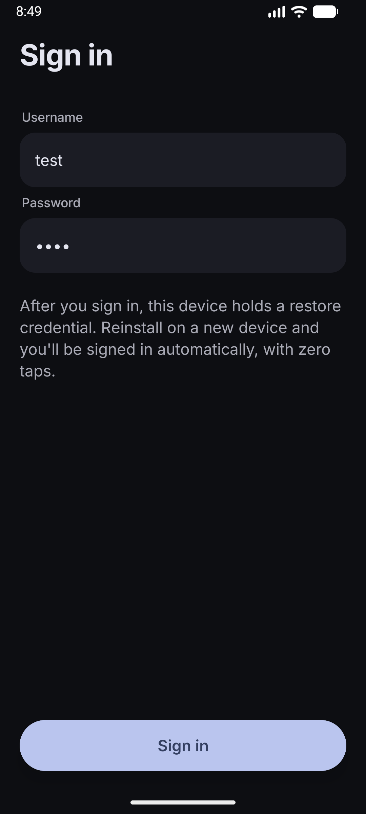
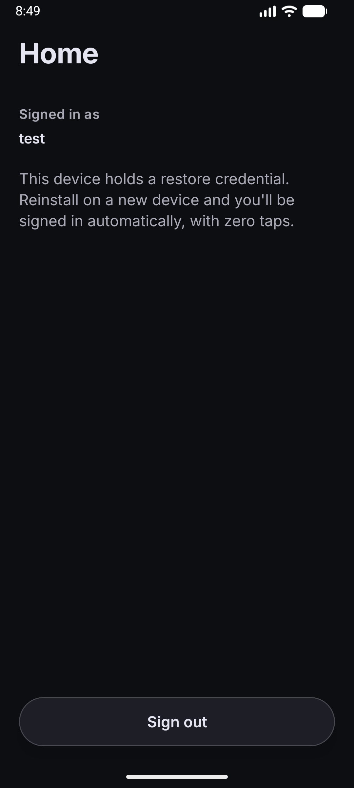

# Restore Credentials Demo

An end-to-end sample of Android's [Restore Credentials](https://developer.android.com/identity/sign-in/restore-credentials) API: a Kotlin/Compose client and a Kotlin/Ktor backend that together sign a user in with zero taps after they reinstall the app on a new device.

Google Play will require Restore Credentials for apps with sign-in starting April 2027 ([announcement](https://android-developers.googleblog.com/2026/08/app-quality-memory-optimization-secure-onboarding.html)).

📝 **Full write-up:** [Android's Restore Credentials API, Explained From Zero](https://medium.com/@lucf15/androids-restore-credentials-api-explained-from-zero-549fbbee35ae?sharedUserId=lucf15).

<p align="center">
  
  &nbsp;&nbsp;
  
</p>

## Repo layout

```
server/            Ktor backend: WebAuthn relying party + session issuance. See server/README.md
android-client/    Android app: Compose UI, Credential Manager integration. See android-client/README.md
TESTING.md         How to exercise the whole flow, including the restore ceremony
```

## How it works

Restore Credentials is WebAuthn/FIDO2, the same protocol as passkeys. A device holds a private key, the server holds the matching public key, and signing in means proving possession of the private key without sending it anywhere. `CreateRestoreCredentialRequest` and `RestoreCredential` carry the standard `PublicKeyCredentialCreationOptionsJSON` / `AuthenticationResponseJSON` payloads a browser would use for a passkey.

Three things are specific to restore:

- Registration requires a **resident (discoverable) key**, so the credential can be found on a new device before the app knows who the user is.
- Authentication is **usernameless**: on a fresh install there is no signed-in user, so the client sends none and the device presents whatever resident key it holds for this app.
- The credential is stored **separately from ordinary passkeys**, one per app per device, hidden from passkey-management UI.

### The flow

1. The user signs in and the server issues a session (here: a 15-minute JWT access token plus a 30-day rotating refresh token).
2. Right after sign-in, with no UI, the app requests WebAuthn registration options, calls `CredentialManager.createCredential()` with a `CreateRestoreCredentialRequest`, and sends the result back for verification.
3. On a new device or after a reinstall, the app calls `CredentialManager.getCredential()` with a `GetRestoreCredentialOption` and no username. If a restore credential exists it comes back with zero taps; the app exchanges it for a fresh session.
4. If nothing comes back (`NoCredentialException`), the app shows the normal sign-in screen.

[Google's guide](https://developer.android.com/identity/sign-in/restore-credentials-implementation) recommends triggering step 3 from two places, both implemented here:

- **`BackupAgent.onRestoreFinished()`**, a background hook the system calls after app data is restored, before the app is opened.
- **A foreground check on first launch**, for when the hook does not fire: dropped network, `allowBackup=false`, or the process-lifecycle case described in `android-client/README.md`.

## You need a domain you control

Credential Manager binds every restore credential to a real HTTPS domain via [Digital Asset Links](https://developers.google.com/digital-asset-links/v1/getting-started). There is no `localhost` exemption. You need:

1. A domain you can publish a static file to.
2. `.well-known/assetlinks.json` at that domain, declaring the app's package name and signing-cert SHA-256 fingerprint. See `assetlinks.json` in this repo for the shape and `server/README.md` for how to get the fingerprint.
3. `RP_ID` / `RP_ORIGIN` pointed at that domain when starting the server.

The API traffic itself stays local: the app reaches the server over `adb reverse tcp:8080 tcp:8080` (USB works too), and Android fetches `assetlinks.json` from Google's own infrastructure regardless of where the API runs.

## Quick start

```bash
# Server
cd server
RP_ID=<your-domain> RP_ORIGIN=https://<your-domain> ANDROID_ORIGINS=android:apk-key-hash:<your-cert-hash> ./gradlew run

# App
cd android-client
./gradlew :app:assembleDebug
adb install -r -t app/build/outputs/apk/debug/app-debug.apk
adb reverse tcp:8080 tcp:8080
```

See `TESTING.md` for the full walkthrough, including the restore ceremony.

## Demo simplifications

- **All state is in-memory** (`server/.../data/InMemory*Repository.kt`). Restarting the server clears every user, credential, and token.
- **`/auth/login` does not check the password.** Any username/password signs in and creates the account on first use. The password field is only there so the sign-in screen is realistic.
